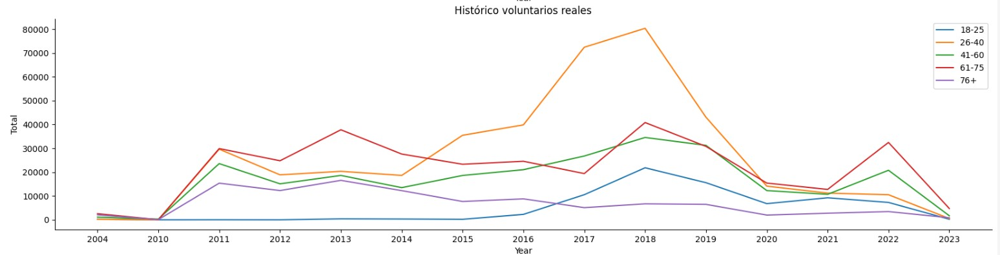

# ETL-project - English volunteers

## CONTEXTO Y OBJETIVO DEL PROYECTO

Ofrecemos programas de voluntariado a personas de habla inglesa alrededor del mundo para que vengan a compartir su tiempo con personas interesadas en mejorar su nivel de inglés.
Los campamentos que se ofrecen pueden ser para adultos o para 'teens' y la duración varía entre 1 o 2 semanas.

Para el proyecto actual vamos a partir de una base de datos con información de todos los voluntarios que se han ido apuntando a diferentes programas a lo largo de los años.
Queremos probar las siguientes hipótesis:

- La mediana de edad (analizando sólo aquellos mayores de 18 años) ronda los 60. Con los años, la mediana de edad de los asistentes a programas ha ido aumentando.

- A raíz del COVID el numero de solicitudes para hacer voluntariado bajó significativamente, pero el número de solicitudes recibidas tiene una tendencia al alza
- El país del que vienen más voluntarios es EEUU. 
- Los menores de edad tienen que ser recogidos en el aeropuerto el día previo al comienzo del programa, y es importante saber por donde llegan la mayoría, ya que hay que organizar logísticamente como va a hacerse. Vamos a comprobar que la terminal4 es el principal punto de llegada.

## APIS
### Vuelos:
[Goflightlabs](https://app.goflightlabs.com), [Documentación](https://app.goflightlabs.com/dashboard). Es una API sencilla de usar, que te permite relizar busquedas de vuelos y aeropuertos. En este caso lo que me interesa es la fecha de llegada y la terminal.
 
### Continentes:
[Listado paises y continentes](https://statisticstimes.com/geography/countries-by-continents.php). Lo escrapee para poder mirar luego de que continente nos llegan más aplicaciones.

 ## RESULTADOS
 ### EDADES

Vemos que en un computo general la mediana de edad, da igual si lo miramos por asistentes o por aplicaciones, es mucho menos de lo esperado, ya que está entre 36 y 41. Vamos a ver si con los años ha podido darse un cambio en tendencia:

 

 Aquí se aprecia como en los últimos años, y más acentuado a raíz del COVID, tanto en aplicaciones como en asistencia real, el mayor número proviene del grupo de 61-75 años. Esto para los programas en si no debería ser malo, pero si que hay que cuidar e intentar atraer grupos más jovenes, ya que nuestro cliente habitual estaría entre los 30-50 años y siempre es interesante tener gente de edades parecidas dado el tiempo que van a compartir.

 El número de solicitudes bajo incluso por debajo de niveles del 2011, pero se ve una tendencia al alza, especialmente entre los grupo de 41-60 y 61-75.

### PAÍSES

Hemos seleccionado aquellos paises con una representación mayor del 2% y hemos agrupado a aquellos que no lo alacanzaban bajo el título 'OTHERS'. 

Claramente USA es el país que más voluntarios aporta. Aun así se ve variedad de acentos de losparticipantes que es lo importante para este tipo de programas. 

Dentro del grupo 'OTHERS' vemos que África es el continente que más aporta.

### AEROPUERTO

## ESTRUCTURA CARPETAS
Hemos creado 5 carpetas en el repositorio. 
- **datos**: aquí encontraremos el csv original, así como todos los que hemos tenido que ir creando para el correcto funcionamiento del estudio.

- **imagenes**: cualquier imagen usada en este readme se podrá encontrar en esta carpeta
- **notebook**: todos los notebooks que hemos ido necesitando (limpieza, datos_SQL, api_call, etc)
- **SQL-model**: SQL script e imagen del diagrama
- **src**: hemos utilizado un archivo soporte.py que se enuentra en esta carpeta y que usaremos para llamar algunas de la funciones utilizadas

## TECNOLOGÍA
[sys](https://docs.python.org/es/3.9/library/sys.html): lo utilizaremos para acceder a los archivos de soporte.py.

[warnings](https://docs.python.org/es/3.9/library/warnings.html?highlight=warnings#module-warnings): para controlar las warnings que puedan aparecer en el proceso.

[pandas](https://pandas.pydata.org/docs/): para operar con pandas en el notebook.

[numpy](https://numpy.org/doc/): para trabajar con numpy en el notebook.

[matplotlib.pyplot](https://matplotlib.org/stable/index.html): para realizar gráficas.

[Datetime](https://docs.python.org/3/library/datetime.html): para operar con fechas.

[folium](https://python-visualization.github.io/folium/): para representación de mapas.

[geopy](https://geopy.readthedocs.io/en/stable/): para obtención de datos geográficos: capitales y coordenadas.

[sqlalchemy](https://docs.sqlalchemy.org/en/14/): para conectar con nuestro MYSQL server.

[getpass](https://docs.python.org/3/library/getpass.html): para que nos solicite la contraseña.

[pickle](https://docs.python.org/3/library/pickle.html): para guardar archivos en este formato, más compacto y rápido de llamar.

[requests](https://requests.readthedocs.io/en/latest/): nos permite mandar peticiones http/1.1 para acceder a la información de una página web.

[bs4 import BeautifulSoup](https://beautiful-soup-4.readthedocs.io/en/latest/): para extraer datos de html.

[os](https://docs.python.org/3/library/os.html): en nuestro caso lo utilizamos para recuperar la 'key' de llamada de la API.